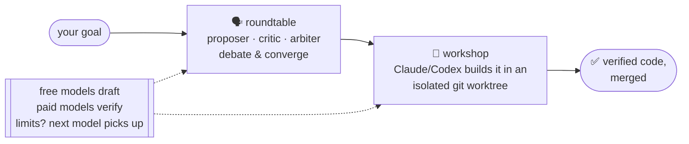

<p align="center">
  
</p>

<p align="center"><b>Many models, working together.</b></p>

[](https://github.com/waksanjeewa/quorum/actions/workflows/ci.yml)
[](LICENSE)

**🌐 Site:** [waksanjeewa.github.io/quorum](https://waksanjeewa.github.io/quorum) &middot; **Docs:** [Getting started](docs/getting-started.md)

**Many models, working together — the session will never die.** Multiple AI models collaborate on one goal — brainstorming,
planning, and building together — handing off to each other when usage limits hit, with you able to
step in at any moment without stopping the work.



Quorum is **local-first**: no server, no accounts, no telemetry. Your prompts and credentials never
leave your machine. It reuses the logins you already have (Claude Code, Codex) and can fall back to
API models or a local Ollama model so a session can run for free.

> Status: **Phases 1–3 implemented and tested.** Models deliberate over a shared transcript, hand off
> on usage limits, and you can inject live — then executor agents carry out the plan by editing code
> in isolated git worktrees, **verified by a reviewer and merged**, running **multiple tasks in
> parallel**. Comes with an interactive shell, a web dashboard (with live settings), a **VS Code
> extension**, `quorum resume`, and frugal free/paid cost policy. All four adapters (Claude, Codex,
> OpenRouter, Ollama) are verified against live models (see
> [e2e/SMOKE-RESULTS.md](e2e/SMOKE-RESULTS.md)). See [DESIGN.md](DESIGN.md) for the full vision and
> [tasks/](tasks/) for the build ledger.

## Why Quorum (vs other AI tools)

Most AI tools give you **one model per request**, or route to whichever model is "best." Quorum makes
several models work **together** on one goal — and keeps going when one runs out.

| | Typical AI tool / router | Quorum |
|---|---|---|
| **Models** | one model answers | several collaborate on one goal |
| **Usage limits** | you stop, wait, or switch by hand | automatic handoff — the session never dies |
| **Quality** | the model checks its own work | a *different* model critiques & reviews it |
| **Building code** | you copy-paste it back yourself | builds in isolated git worktrees, verified, merged |
| **Cost** | a paid model for everything | free models draft, paid models only verify |
| **Privacy** | cloud — your data leaves | local-first — keys stay in your OS Keychain |
| **Ownership** | locked to one vendor | mix any models; state is plain files you own |

## How it works

**Quorum itself is the orchestrator — not one of the models.** The engine decides who speaks when,
hands off the moment a model hits its usage limit, assigns the building, runs your checks, and merges.
The models just take **seats** at the table, each with a distinct role:

- **Proposer** — advances one concrete approach toward the goal. Decisive and specific.
- **Critic** — hunts for weaknesses, gaps, and risks, and **can't rubber-stamp early** (no APPROVE
  before turn 3). This is where mistakes get caught.
- **Arbiter** — weighs proposal against critique, breaks ties, and calls when it's good enough.

They deliberate turn by turn over a **shared transcript** until they converge. **Claude and Codex are
the executors** — the only models that can edit files and build; free models (Ollama, OpenRouter)
deliberate, draft, and verify. Every seat is a **failover chain**: all state lives in plain files, so
**no model ever owns the task** — when one model's usage window closes, the next model in that seat's
chain reads the transcript and picks up exactly where it left off. If every primary is exhausted, a
free local model keeps things going.

```
Goal → Brainstorm → Plan → Decompose → Build → Verify + Review → Merge
       └─ proposer · critic · arbiter debate ─┘  └ executor in a git worktree, a 2nd model judges ┘
       (you can inject a message at any point, without stopping the work)
```

## Getting started

**Install** (while the repo is private, install from source):

```bash
curl -fsSL https://raw.githubusercontent.com/waksanjeewa/quorum/main/install.sh | bash
# or: git clone https://github.com/waksanjeewa/quorum && cd quorum && ./install.sh
```

*(An npm one-liner is coming. Note: the bare name `quorum` is already taken on npm, so the published
package will be scoped — likely `npm install -g @waksanjeewa/quorum`.)*

**Log in to the models you want** — Quorum reuses logins you already have, no API keys required:

```bash
claude login      # for a `claude` seat (Claude Max/Pro)
codex login       # for a `codex` seat (ChatGPT Plus/Pro)
# optional: export OPENROUTER_API_KEY=...   for OpenRouter (free & paid models)
# optional: ollama serve                    for a free local fallback
```

**Then just run `quorum`** — it drops you into an interactive shell (no config files to edit):

```
$ quorum
  quorum› /models          ← pick your models: log in, or paste an API key (saved to your Keychain)
  quorum› build me a CLI that converts CSV to JSON
  … streams live — type to add a message, /pause, /stop …
  quorum› /help            ← /models /doctor /status /pause /resume /stop /config /exit
```

Prefer one-shot commands? `quorum setup` (pick models), `quorum doctor` (check readiness),
`quorum start "<goal>"` (run once) all work too.

In a **git repo**, `start` runs the whole thing autonomously — the models deliberate, converge on a
plan, then an executor builds it in an isolated worktree, verifies it, and merges. In a non-git
directory it deliberates and produces a plan (`git init` to enable building). Open the printed
dashboard URL to watch live, drop in a message, or hit **STOP**.

Commands: `quorum init` · `doctor` · `start "<goal>"` · `status` · `inject "<msg>"` · `pause` ·
`resume` · `stop` · `attach`.

## Configuration

Create `.quorum/config.yaml` in your project. Each seat has a **failover chain** — tried in order:

```yaml
seats:
  proposer: { chain: [claude, openrouter/deepseek/deepseek-chat:free, ollama/llama3] }
  critic:   { chain: [codex,  openrouter/deepseek/deepseek-chat:free, ollama/llama3] }
  arbiter:  { chain: [openrouter/google/gemini-2.5-pro, ollama/llama3] }
budgets:
  max_turns_per_stage: 12
providers:
  openrouter: { base_url: "https://openrouter.ai/api/v1", key_env: OPENROUTER_API_KEY }
```

- `claude` / `codex` reuse your existing subscription logins — no API key needed.
- `<provider>/<model>` uses the generic OpenAI-compatible client — OpenRouter, Groq, Together AI,
  Fireworks AI, DeepInfra, a local [OmniRoute](https://github.com/diegosouzapw/OmniRoute)/LiteLLM
  gateway, or a direct API.
- `ollama/<model>` is the never-offline free fallback.

API keys come from environment variables (or your OS Keychain) only — never stored in files.

### One key, many models (skip multiple subscriptions)

You don't need to subscribe to every AI. A single **aggregator** key unlocks dozens of models — GPT,
Claude, Gemini, Llama, DeepSeek, and more — and Quorum will seat *several of them at once* as
proposer, critic, and arbiter, giving you real multi-model debate from one login:

```yaml
# Just an OpenRouter key → a full roundtable, three different models:
seats:
  proposer: { chain: [openrouter/deepseek/deepseek-chat:free] }   # free model drafts
  critic:   { chain: [openrouter/anthropic/claude-3.7-sonnet] }   # a strong model critiques
  arbiter:  { chain: [openrouter/google/gemini-2.5-pro] }         # a third decides
providers:
  openrouter: { base_url: "https://openrouter.ai/api/v1", key_env: OPENROUTER_API_KEY }
```

Built-in aggregators (just add the API key — no `providers:` block needed for these):

| Provider | Model-id prefix | Key env |
|---|---|---|
| **GitHub Models** (Copilot users) | `github/…` | `GITHUB_TOKEN` |
| OpenRouter | `openrouter/…` | `OPENROUTER_API_KEY` |
| Groq | `groq/…` | `GROQ_API_KEY` |
| Together AI | `together/…` | `TOGETHER_API_KEY` |
| Fireworks AI | `fireworks/…` | `FIREWORKS_API_KEY` |
| DeepInfra | `deepinfra/…` | `DEEPINFRA_API_KEY` |

**Using GitHub Copilot / a GitHub account?** Pick **GitHub Models** in `/models` and paste a GitHub
token (a fine-grained PAT with the **Models** permission, or `gh auth token`) — that unlocks GPT-4o,
Llama, Mistral and more on GitHub's free tier, so a Copilot user can run the whole table on their
GitHub login alongside any free model. Example: `github/gpt-4o-mini`.

> **Note:** aggregator models plan, debate, and verify — but to **build code autonomously** you still
> need a **Claude** or **Codex** login, since those two are the executors that edit files in a
> worktree. An `openrouter/anthropic/claude-…` is chat-only and can't drive the build loop. In setup,
> pick an aggregator and Quorum offers to auto-spread its models across the three seats for you.

### Agents & execution (the swarm)

When building, independent tasks run as a **parallel swarm** of executor agents, and Claude executors
can spawn **subagents** (the Task tool) when a task warrants it. Toggle both in the dashboard
**⚙ Settings → Agents & execution**, or in config:

```yaml
execution:
  parallel: true        # run independent tasks at once; false ⇒ one at a time
  max_concurrency: 4    # cap; omit for auto
  subagents: true       # let Claude executors spawn subagents when useful
```

## Architecture

A TypeScript / pnpm monorepo (`core ← adapters ← daemon ← cli`; the dashboard is served over HTTP):

| Package | Role |
|---|---|
| `@quorum/core` | Types, the on-disk ledger, and the roundtable engine |
| `@quorum/adapters` | Model adapters (Claude, Codex, Ollama, generic HTTP) + failover seat manager |
| `@quorum/daemon` | Session manager + local HTTP/SSE API |
| `@quorum/dashboard` | Self-contained local web UI |
| `quorum` (cli) | The command-line entry point |

Run the tests with `corepack pnpm test`. For a manual check against real models, see
[e2e/SMOKE.md](e2e/SMOKE.md).

## Documentation

- **[Getting started](docs/getting-started.md)** — prerequisites, install, first goal
- **[Configuration](docs/configuration.md)** — model ids (incl. `claude/<model>`, OpenRouter free
  models, Hermes, gateways), frugal mode, budgets
- **[Architecture](docs/architecture.md)** — how the roundtable, failover, and workshop work (with diagrams)
- **[Publishing](docs/publishing.md)** — how to go public + `npm publish` the one-liner

## Cost policy: frugal by default

Mix free and paid models and Quorum offers **frugal mode**: free models (Ollama, OpenRouter `:free`)
do the bulk drafting; your paid models are spent only on verifying and improving; Claude/Codex do
the building. Hard caps (`max_cost_usd`, `wall_clock_max`) back it up.

## License

MIT — see [LICENSE](LICENSE).
