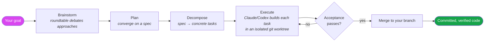
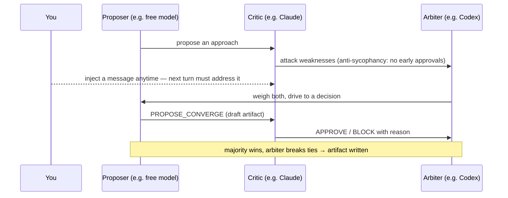
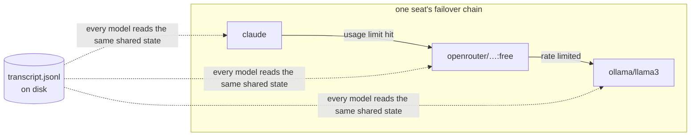
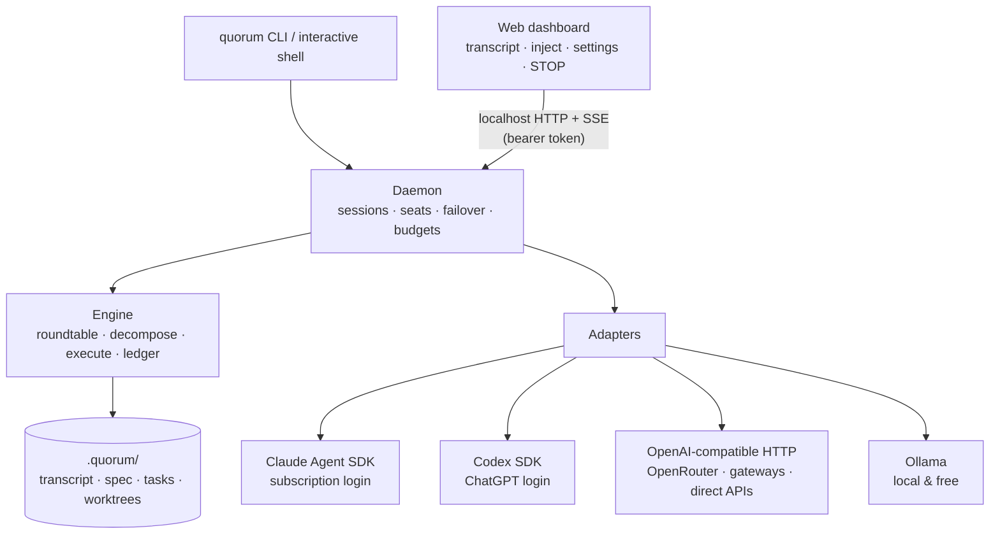

# Architecture

Quorum's founding principle: **no agent ever owns the task.** All state — the conversation, the
plan, the task ledger — lives in plain files on disk. Any model can take any seat at any time, so
handoff isn't failover, it's the normal lifecycle.

## The pipeline

Deliberation stages work anywhere (plans, documents, decisions); the execute stage needs a git repo.

## The roundtable

## Usage-limit failover (why sessions never die)

The transcript is the brain, not any model's context window. When a seat's model hits its window,
the next one in the chain reads the transcript tail (plus a rolling summary) and continues the same
seat mid-conversation. If an **executor** hits its limit mid-task, the next Claude/Codex resumes in
the **same worktree**.

## Components

Monorepo dependency direction: `core ← adapters ← daemon ← cli`; the dashboard talks HTTP/SSE only.

## Cost policy (frugal mode)

Free models are excellent at volume (drafting, exploring options); paid models are worth their cost
for judgement (verifying, catching flaws, deciding). Frugal mode encodes exactly that:

| Seat | Chain order | Spends |
|---|---|---|
| Proposer (volume) | free → paid | ~nothing |
| Critic (verification) | paid → free | quality tokens only |
| Arbiter (decisions) | a different paid → free | quality tokens only |
| Executor (building) | always Claude/Codex | subscription |

## Security model

- Local only: daemon binds `127.0.0.1`, per-run bearer token; the dashboard is served locally.
- Credentials: existing CLI logins are reused as-is; API keys live in env vars or the OS Keychain —
  **never in files**.
- Building: isolated worktrees, acceptance-gated merges, no pushes/deploys, instant kill switch.
